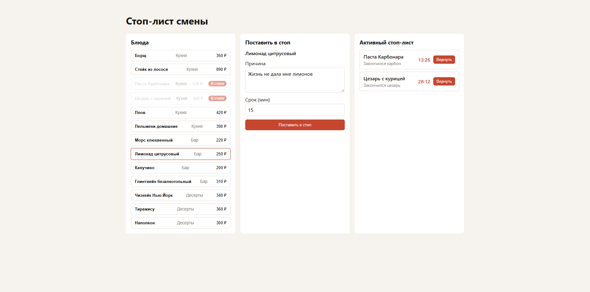

# Стоп-лист смены

Тестовое задание для позиции Junior Fullstack Developer (React + Express).
Сервис для управления стоп-листом блюд: повар ставит блюдо в стоп с причиной и сроком, зал видит актуальный список и понимает, когда блюдо вернётся в продажу.

**Превью:** https://client-beta-swart-60.vercel.app

## Скриншот



## Стек

- **Backend:** Node.js, Express, TypeScript
- **Frontend:** React, TypeScript, Vite
- **База данных:** SQLite + Prisma ORM
- **Монорепозиторий:** `server/` и `client/` в одном репозитории

## Структура проекта

```
stop-list/
├── server/          # Express API
│   ├── src/
│   │   ├── routes/       # разбор HTTP-запроса и вызов сервиса
│   │   ├── services/     # бизнес-логика, не знает про Express
│   │   ├── repositories/ # доступ к данным за интерфейсом
│   │   ├── domain/       # доменные ошибки и чистые функции логики
│   │   ├── middleware/   # validate, errorHandler, asyncHandler
│   │   ├── seed/         # сид-данные блюд
│   │   └── test/         # юнит- и интеграционные тесты
│   └── prisma/
├── client/          # React-приложение
│   └── src/
│       ├── api/          # клиент API, типы ответов
│       ├── hooks/        # состояние экрана и мутации
│       └── components/
├── shared/          # общие типы и валидация для server и client
│   └── src/
│       ├── api/          # DTO для запросов/ответов
│       ├── domain/       # доменные типы и константы
│       └── validation/   # схемы валидации + типы, выведенные из схем
└── README.md
```

## Как запустить локально

### 1. Клонировать репозиторий

```bash
git clone <ссылка на репозиторий>
cd stop-list
```

### 2. Установить зависимости

```bash
npm install
```

### 3. Backend

```bash
cd server
npm install
cp .env.example .env
npx prisma migrate dev
```

### 4. Frontend

```bash
cd client
cp .env.example .env
```

### 5. Запустить приложение

```bash
npm run dev
```

Сервер будет доступен по адресу `http://localhost:{PORT}`
Клиент будет доступен по адресу `http://localhost:5173`

## API

Базовый URL: `/api`

Формат ошибки единый для всего API:

```json
{
  "error": {
    "code": "DISH_ALREADY_STOPPED",
    "message": "Блюдо уже в стоп-листе"
  }
}
```

### `GET /api/dishes`

Справочник блюд

**Ответ 200**

```json
[
  { "id": "dish_1", "name": "Борщ", "category": "Кухня", "price": 350 },
  { "id": "dish_2", "name": "Мохито", "category": "Бар", "price": 420 }
]
```

### `POST /api/stop-list`

Поставить блюдо в стоп-лист

**Запрос**

```json
{
  "dishId": "dish_1",
  "reason": "Закончился картофель",
  "durationMinutes": 60
}
```

**Ответ 201**

```json
{
  "id": "entry_1",
  "dishId": "dish_1",
  "reason": "Закончился картофель",
  "stoppedAt": "2026-09-26T10:00:00.000Z",
  "expiresAt": "2026-09-26T11:00:00.000Z",
  "returnedAt": null
}
```

**Возможные ошибки**

| Код   | Причина                                                                                                                   |
| ----- | ------------------------------------------------------------------------------------------------------------------------- |
| `404` | Блюдо с указанным `dishId` не найдено                                                                                     |
| `409` | У блюда уже есть активная запись в стоп-листе                                                                             |
| `422` | `reason` короче 5 или длиннее 200 символов после `trim()`, либо `durationMinutes` не целое число или вне диапазона 15–720 |

```json
{ "error": { "code": "DISH_NOT_FOUND", "message": "Блюдо dish_1 не найдено" } }
```

### `GET /api/stop-list`

Активные записи стоп-листа с расчётом оставшегося времени

**Query-параметры**

| Параметр   | Обязательный | Описание                                             |
| ---------- | ------------ | ---------------------------------------------------- |
| `category` | нет          | Фильтр по категории блюда: `Кухня`, `Бар`, `Десерты` |

**Пример:** `GET /api/stop-list?category=Кухня`

**Ответ 200**

```json
[
  {
    "id": "entry_1",
    "dishId": "dish_1",
    "reason": "Закончился картофель",
    "stoppedAt": "2026-09-26T10:00:00.000Z",
    "expiresAt": "2026-09-26T11:00:00.000Z",
    "returnedAt": null,
    "dish": {
      "id": "dish_1",
      "name": "Борщ",
      "category": "Кухня",
      "price": 350
    },
    "status": "active",
    "minutesLeft": 42
  }
]
```

### `PATCH /api/stop-list/:id/return`

Досрочный возврат блюда в продажу

**Ответ 200**

```json
{
  "id": "entry_1",
  "dishId": "dish_1",
  "reason": "Закончился картофель",
  "stoppedAt": "2026-09-26T10:00:00.000Z",
  "expiresAt": "2026-09-26T11:00:00.000Z",
  "returnedAt": "2026-09-26T10:20:00.000Z"
}
```

**Возможные ошибки**

| Код   | Причина                                                     |
| ----- | ----------------------------------------------------------- |
| `404` | Запись с указанным `id` не найдена                          |
| `409` | Запись уже возвращена или истекла — вернуть повторно нельзя |

### `GET /api/stop-list/history`

История завершённых записей (возвращённых или истёкших), сортировка от новых к старым

**Query-параметры**

| Параметр | По умолчанию | Диапазон  |
| -------- | ------------ | --------- |
| `limit`  | `20`         | `1`–`100` |
| `offset` | `0`          | `>= 0`    |

Некорректные значения возвращают `422`.

**Ответ 200**

```json
{
  "items": [
    {
      "id": "entry_5",
      "dishId": "dish_3",
      "reason": "Сломалась плита",
      "stoppedAt": "2026-09-25T18:00:00.000Z",
      "expiresAt": "2026-09-25T19:00:00.000Z",
      "returnedAt": "2026-09-25T18:45:00.000Z",
      "dish": {
        "id": "dish_3",
        "name": "Стейк",
        "category": "Кухня",
        "price": 890
      }
    }
  ],
  "total": 34,
  "limit": 20,
  "offset": 0
}
```

## Архитектурные решения

- **SQLite вместо PostgreSQL** — чтобы не поднимать и не настраивать отдельную БД под тестовое задание; для объёма и задач проекта её возможностей достаточно.
- **Справочник блюд не в БД, а в памяти** — по условиям ТЗ блюда заводятся только через сид и не изменяются через API, поэтому отдельная таблица и слой хранения для них избыточны.
- **Пагинация и фильтрация реализованы в коде, а не средствами БД** — при небольшом объёме данных это проще и достаточно производительно; расчёт `minutesLeft` и статуса записи всё равно происходит на лету.
- **Монорепозиторий (`server/` + `client/` в одном репо)** — позволяет держать общие TypeScript-типы и схемы валидации в одном месте и не дублировать их между клиентом и сервером.
- **Бизнес-логика вынесена из роутов в сервисный слой** — сервис ничего не знает про Express (`req`/`res`), время передаётся как зависимость (`now: () => Date`), что делает логику проверяемой юнит-тестами и не завязанной на фреймворк.
- **Доступ к данным спрятан за интерфейсом репозитория** — сервисный слой работает с абстракцией, а не напрямую с Prisma, что упрощает замену хранилища при необходимости.
- **Истечение срока считается «на лету»** — запись со `expiresAt <= now` считается неактивной без фоновых задач и без обновления БД; `returnedAt` при этом остаётся `null`, отличая `expired` от `returned`.

## Что бы доделал при наличии больше времени

- Более глубокая декомпозиция компонентов на фронтенде.
- Доработка и полировка стилей клиентской части.
- Тесты логики и компонентов на клиенте.
